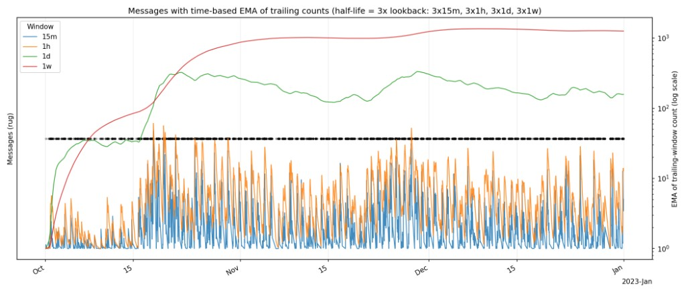
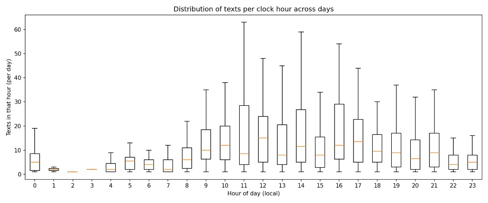
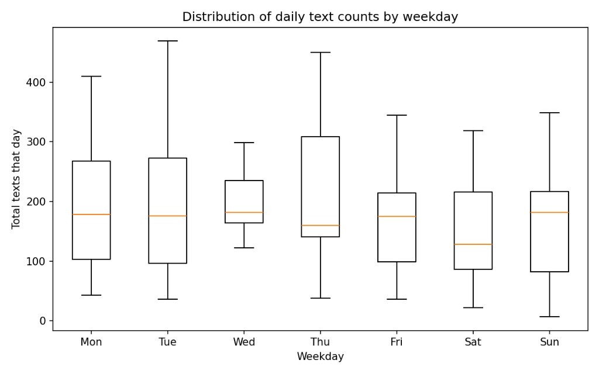
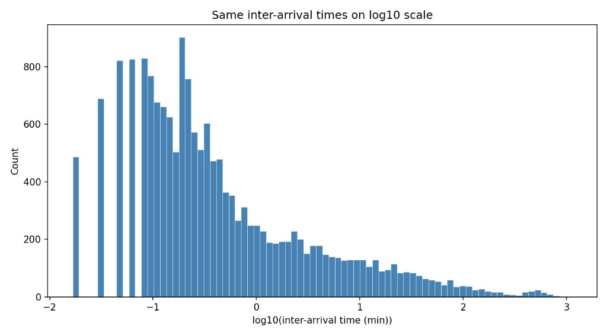
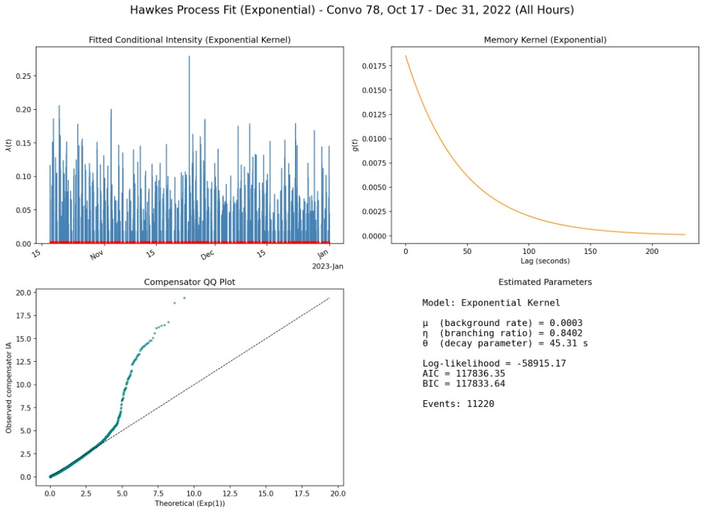
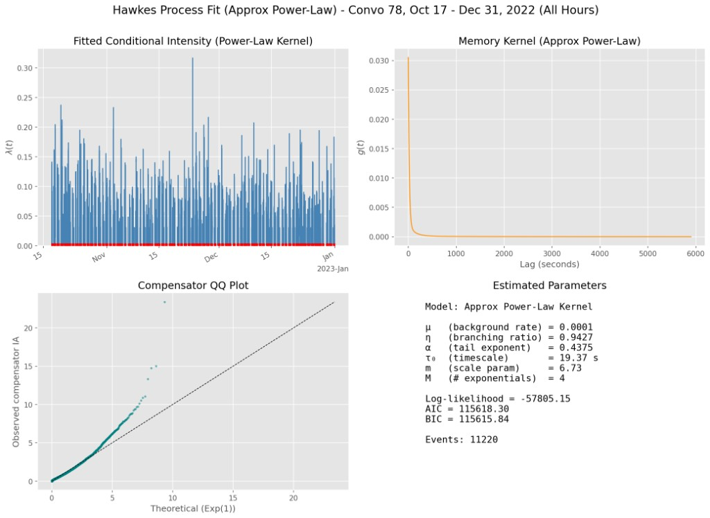
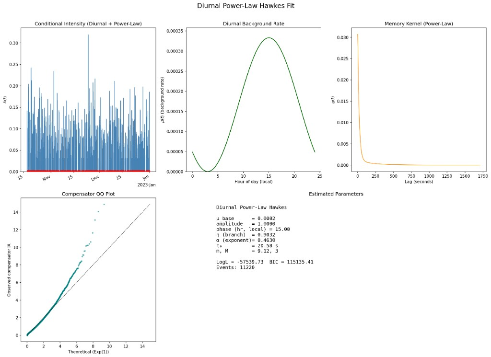
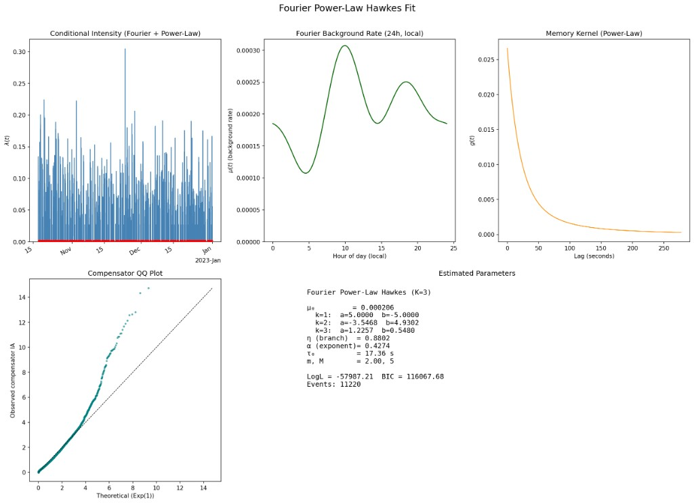
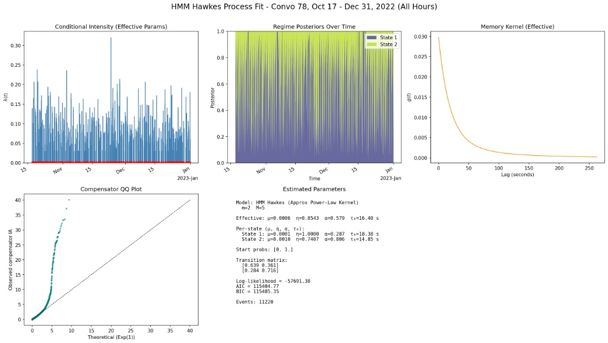

## Introduction

I first encountered Hawkes processes while watching a video on statistical mechanics, and the concept piqued my interest immediately. As I searched for a portfolio project to bridge the gap between technical rigor and personal curiosity, this felt like the perfect entry point.

At its core, a Hawkes process models self-exciting events: phenomena where one occurrence increases the probability of another in the near future. The classic analogy is an earthquake, where an initial shock almost guarantees a cluster of aftershocks. This behavior is a fundamental pattern in many complex systems.

I decided to apply this framework to something much closer to home: my own texting history. Communication, much like seismic activity, is rarely composed of isolated incidents; it is a cascade of notifications, immediate replies, and bursts of activity. My goal was to see if the mathematics of self-excitation could accurately capture the organic rhythm of my digital life.

## Data

I pulled my data from Apple's Messages using code inspired by [this repo](https://github.com/reagentx/imessage-exporter) and immediately ran into a classic data science dilemma: too much data for local processing. With thousands of conversations dating back to 2019, I had to be aggressive with my filtering to keep the project computationally tractable.

I stripped the dataset down to its bare essentials to prioritize performance and anonymity. Each conversation was assigned a unique ID, logging only the timestamps and a binary flag for whether I was the sender or receiver. I removed one-sided exchanges and extremely short threads. To simplify group chats, I collapsed all other participants into a single "external" sender category, focusing the model entirely on the bi-directional flow of interaction.

For the modeling phase, I selected my most message-heavy thread and zoomed in on Q4 2022 to capture a high-activity window.

The plots confirmed my intuition: the sequence was highly self-exciting and cyclic, yet rife with long periods of silence that truly defined the conversations.

## Models

Before diving into the specific models I tested, it helps to establish a baseline for how a Hawkes process mathematically operates.

In simple terms, a Hawkes process estimates "intensity." Think of intensity as the ambient temperature of a conversation—the rate at which events are expected to occur at any given moment. This estimation combines a static baseline intensity with a sum over all past events. This sum is governed by a *kernel*, which dictates how much a single past text spikes the current intensity, and how quickly that influence decays over time.

Here is the standard equation for a Hawkes process with a basic exponential kernel:

$\lambda(t) = \mu + \sum_{t_i < t} \eta \theta e^{-\theta(t - t_i)}$

  - $\lambda(t)$: The conditional intensity (the expected texting rate) at time $t$.
  - $\mu$: The background rate (spontaneous texts unprompted by a previous message).
  - $t_i$: The timestamps of previous texts (strictly before time $t$).
  - $\eta$: The branching ratio (the average number of follow-up texts a single message triggers. This must be strictly less than 1 to prevent the system from exploding to infinity).
  - $\theta$: The decay rate of the exponential kernel (how rapidly the urge to reply fades over time).

I used this basic exponential kernel model as my starting point.

As shown in the compensator Q-Q plot, which compares the expected wait time between events according to the model versus the actual observed time, this model fits the rapid-fire, back-and-forth texting beautifully. However, it completely fails to model the long stretches of silence between conversations. Bridging that gap became the target for my subsequent iterations.

Next, I implemented a power-law kernel. The main difference between an exponential and a power-law kernel lies in their "memory." An exponential kernel decays extremely fast, essentially dropping off a cliff. A power-law kernel has a fat tail, meaning its decay slows down over time. I hypothesized this would provide the model with longer-term memory, potentially capturing dynamics like interrupted conversations picked up hours later.

While this was undeniably an improvement in fit across both the Q-Q plot and log-loss, and BIC metrics, it still fundamentally failed to map the quiet periods.

This is where I encountered a major blind spot in my assumptions: sleep. It is incredibly difficult to text while asleep, which naturally drives the event rate to near zero. To account for this diurnal rhythm, my first instinct was to split the dataset into "day" and "night" phases. In hindsight, this was a naive assumption. Chopping up the dataset completely severs the time continuity of the data, a fatal flaw when utilizing a point-process model that relies entirely on sequential chronological events.

Scrapping the split-data approach, I returned to a continuous timeline and pivoted to a diurnal cycle baseline power-law kernel model. This approach introduces a continuous daily cycle directly into the background rate ($\mu$), allowing the baseline probability of texting to naturally ebb and flow with the sun.

This was an improvement over the static baseline, but comparing the hourly boxplots to the fitted diurnal cycle revealed the model was still too rigid to capture the nuanced fluctuations of a real human day.

To fix this, I applied a Fourier basis model. By injecting a Fourier series into the background rate ($\mu$), the model gains significant flexibility, allowing the baseline probability to ripple and adjust to multiple peaks and valleys throughout a 24-hour period.

This model was easily the most accurate so far. The FFT baseline aligns cleanly with the EDA boxplots, and the power-law kernel successfully handles the self-excitation. Yet, looking at the compensator Q-Q plot, the model was *still* struggling with conversation endpoints.

For my final attempt, I utilized a Hidden Markov Model (HMM). By introducing a latent variable, the model can dynamically switch between "active" and "inactive" regimes, theoretically allowing it to explicitly shut down and enter a silence period.

According to the log-likelihood, this was the strongest fit. However, a deeper look reveals a critical flaw: because the HMM is purely probabilistic and blind to the actual content of the texts, it is essentially guessing when to switch regimes. The boosted metrics were likely a result of overfitting rather than a fundamental gain in explanatory power.

At this stage, I reached another classic data science crossroads: the point of diminishing returns. To accurately predict when a conversation ends, I would need to feed the model context—such as message length as a proxy for depth, or full NLP embeddings to capture semantic closure (e.g., recognizing "goodnight" or "talk later"). Rather than bolting computationally massive workarounds onto a time-series model, I decided to scope the project to a closer goal.

## Conclusion and Limitations

While the hypothesis that texting is highly self-exciting proved completely true, with even the simplest exponential kernel mapping the rapid-fire responses beautifully, the true difficulty lies in modeling the boundaries of human interaction.

Ultimately, this project was an exercise in understanding point-process modeling on organic data, rather than building a commercially viable communication predictor. From that perspective, it was a success. The core mathematics of self-excitation translate remarkably well to human behavior.

However, if I were to scale this into a generalized network communication model, several major statistical challenges would immediately need to be addressed:

  * **Rampant Non-Stationarity:** Texting data going back to 2019 inherently violates the assumption of a static system. Relationships evolve, friendships fade, and communication styles shift. Parameterizing a multi-year span without assuming a constant social dynamic requires dynamic weighting.
  * **The Cross-Validation Nightmare:** Because these dynamics shift so heavily out-of-sample, implementing a meaningful temporal cross-validation methodology is difficult. A model trained on 2020 lockdown texting habits would spectacularly fail to predict 2023 behavior.
  * **Parameterizing Quirkiness:** Texting dynamics are highly subjective. The branching ratio ($\eta$) and decay rate ($\theta$) that define a chat with a best friend are different compared to a family group chat.
  * **The "Double Text" Dilemma:** Basic data definitions get murky in practice. Should consecutive texts sent by the same person be combined into a single "event"? If so, what is the arbitrary time-delta cutoff that separates a fragmented thought from a genuine double-text?
  * **Semantic Embedding:** Significant architectural changes would be required to translate conversational meaning into the model. Time deltas alone cannot explain why a conversation ends; semantic context does.

While the Hawkes process provides a beautiful mathematical framework for the "pings" of self-excitation, human communication is ultimately bounded by context, content, and the chaos of daily life, variables that require much more than a timestamp to decode.